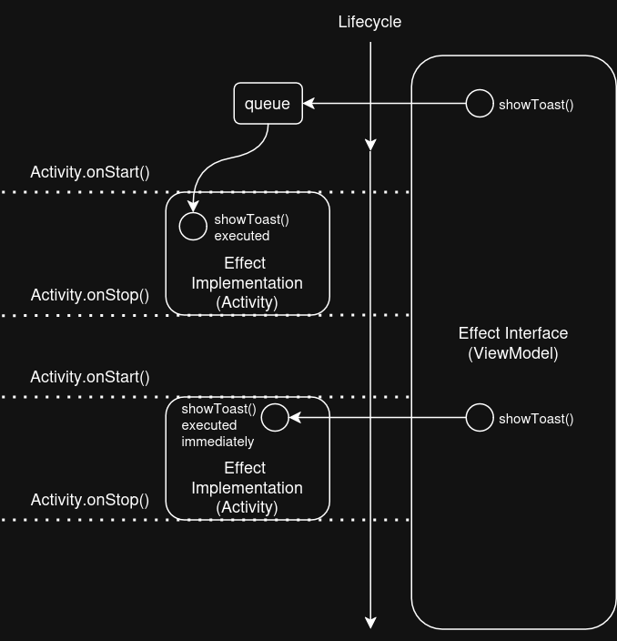

# Hilt plugin for easier implementation of one-off events (a.k.a. effects) :fire:

Now compatible with KSP and Jetpack Compose.

[](https://uandcode.com/sh/effects)
[](LICENSE)


This plugin eliminates the usage of `Channel`, `SharedFlow`, or event properties in state classes.
As a result, you can work with one-off events more easily. For example,
you can show toasts, display dialogs, execute navigation commands in a view-model
without memory leaks.

> In general, the plugin allows components with a longer lifecycle to interact with
components with a shorter lifecycle without memory leaks.

## Table of Contents

- [Prerequisites](#prerequisites)
- [Installation](#installation)
- [Installation for Multi-Module Projects](#installation-for-multi-module-projects)
- [Primitive Example](#primitive-example)
- [Default Lifecycle](#default-lifecycle)
- [Detailed Explanation](#detailed-explanation)
    1. [One-off Event](#one-one-off-event)
    2. [Suspend Call](#two-suspend-call)
    3. [Flow Call](#three-flow-call)
- [Manual Clean-up](#manual-clean-up)
- [Multiple Effect Handlers](#multiple-effect-handlers)
- [Multiple Target Interfaces](#multiple-target-interfaces)
- [Multi-Module Projects](#multi-module-projects)
- [Limitations](#limitations)

## Prerequisites

1. Use the latest version of Android Studio.
2. Make sure [Hilt](https://developer.android.com/training/dependency-injection/hilt-android) is added properly to your project. Minimal version of Hilt should be `2.48.1`.
3. Make sure [KSP](https://kotlinlang.org/docs/ksp-quickstart.html#add-a-processor) plugin is added to your project.

Check out [this page](docs/ksp-and-hilt-installation.md) for more details about installation of Hilt + KSP.

## Installation

1. Add [Hilt and KSP](docs/ksp-and-hilt-installation.md) to your Android project
2. Add the following dependencies:

```kotlin
// annotation processor (required):
ksp("com.elveum:effects-processor:1.0.3")

// for projects with Jetpack Compose:
implementation("com.elveum:effects-compose:1.0.3")

// for projects without Jetpack Compose:
implementation("com.elveum:effects-core:1.0.3")
```

## Installation for Multi-Module Projects

- Dependencies for your application module remain the same:
  
  ```kotlin
  ksp("com.elveum:effects-processor:1.0.3")
  implementation("com.elveum:effects-compose:1.0.3") // with Jetpack Compose
  implementation("com.elveum:effects-core:1.0.3") // or without Jetpack Compose
  ```

- Additional configuration is required for your android library modules, if you
  plan to use `@HiltEffect` annotation not only in the application module but also in the library modules:

  1. Make sure KSP and Hilt are added and configured in the library module.
  2. Add the following additional KSP option:

  ```kotlin
  // my-android-lib/build.gradle.kts:
  ksp {
      arg("effects.processor.metadata", "generate")
  }
  ```
  
## Primitive Example

The main idea of this plugin is to simplify one-off events by moving them to a separate
interface. No more `SharedFlow`, `Channel`, additional event properties in state classes representing events, etc.

Let's imagine you want to:
- execute navigation commands
- show an alert dialog and get the user choice
- show toasts, snackbars, etc.
- subscribe to onClick events
- get an access to an Activity from any location in your code

1. Define an interface:

   ```kotlin
   interface MyEffects {
       
       // simple effect (one-off event)
       fun launchCatDetails(cat: Cat)
       
       // effect which can return a result
       suspend fun showAlertDialog(message: String): Boolean
       
       // effect which can return an infinite number of results
       fun listenClicks(): Flow<String>
   }
   ```

2. Inject the interface to a view-model constructor (yep, you don't need to create a separate Hilt module):

   ```kotlin
   @HiltViewModel
   class CatsViewModel @Inject constructor(
       // inject your interface here:
       val myEffects: MyEffects
   ): ViewModel() {

       fun onCatChosen(cat: Cat) {
           viewModelScope.launch {
               // example of using the effect which can return a result
               val confirmed = myEffects.showAlertDialog(
                   message = "Are you sure you want to open details screen?"
               )
               if (confirmed) {
                   // example of sending the one-off event 
                   myEffects.launchCatDetails(cat)
               }
           }
       }

   }
   ```

3. Implement the interface and annotate the implementation with `@HiltEffect`.
   As a result, a Hilt module will be automatically generated for you. And
   in addition, you can safely use an activity reference or any other UI-related
   stuff in the implementation:

   ```kotlin
   @HiltEffect // <-- do not forget this annotation
   class MyEffectsImpl(
       // you can add any UI-related stuff to the constructor without memory leaks
       private val activity: ComponentActivity,
   ): MyEffects {

       override fun launchCatDetails(cat: Cat) {
           // use an activity reference for launching a new page (via fragment manager,
           // navigation component, etc.)
       }

       override suspend fun showAlertDialog(message: String): Boolean {
           // suspend function is automatically cancelled when activity is stopped
           // and then executed again when activity is started
           return suspendCancellableCoroutine { continuation ->
               //
               // show alert dialog here; use 'continuation' to send a user choice
               //
               continuation.invokeOnCancellation {
                   // cancel alert dialog here, e.g.:
                   dialog.dismiss()
               }
           }
       }

       override fun listenClicks(): Flow<String> {
           // flow is automatically cancelled when activity is stopped
           // and then executed again when activity is started if the flow hasn't been completed yet
           return callbackFlow { // channelFlow { ... } and flow { ... } can be used too
             // do something here
           }
       }
   }
   ```

4. Use the implementation either in @Composable functions or in Activity/Fragment classes :

    - for projects with Jetpack Compose:

      ```kotlin
      @AndroidEntryPoint
      class MainActivity: AppCompatActivity() {
 
          override fun onCreate(savedInstanceState: Bundle?) {
              super.onCreate()
              setContent {
                  // create an effect implementation
                  val effectImpl = remember { MyEffectsImpl(this) }
                  // connect the effect implementation to an interface injected to
                  // a view-model constructor:
                  EffectProvider(effectImpl) {
                      MyApp()
                  }
              }
          }
      }
      
      @Composable
      fun MyApp() {
          // you can use getEffect() call to get an instance 
          // of effect implementation class
          val myEffectsImpl = getEffect<MyEffectsImpl>()
          // or: 
          val myEffects = getEffect<MyEffects>()
      }
      
      ```

    - for projects without Jetpack Compose:

      ```kotlin
      @AndroidEntryPoint
      class MainActivity: AppCompatActivity() {
 
          private val myEffectsImpl: MyEffectsImpl by lazyEffect {
              MyEffectsImpl(this)
          }
          // or:
          private val myEffects: MyEffects by lazyEffect {
              MyEffectsImpl(this)
          }
          
      }
      ```

Check out an example app in this repository for more details ;)

## Default Lifecycle

By default, all effect interfaces are installed to a Hilt `ActivityRetainedComponent`.
This allows you injecting effect interfaces directly to a view-model constructor.

You can treat any effect interface injected to a view-model constructor as an __event sender__,
and any effect implementation created by `lazyEffect` delegate or by `EffectProvider` @Composable
function as an __event handler__.

If there is at least one active handler, it can process incoming events sent by the interface.
So actually, when you use `lazyEffect` or `EffectProvider`, you connect an event handler to an event sender.
If there is no active event handlers, events are added to a queue.



Let's take a brief look at different ways of connecting event handlers:

1. `lazyEffect { ... }` delegate can be used directly in activities and/or fragments.
   It automatically connects an event handler when an activity/fragment
   is started, and then disconnects it when the activity/fragment is stopped.
2. `EffectProvider { ... }` composable function is intended to be used in
   other @Composable functions. It works almost in the same way
   as `lazyEffect` delegate, but also it automatically disconnects the effect implementation
   when `EffectProvider` composition is going to be destroyed. Also `EffectProvider` provides
   you an additional function `getEffect<T>()` which can be used for retrieving handlers.
3. `EffectController<T>` instances; usually you don't need to use effect controllers
   directly. But in rare cases it may be useful, e.g. in custom UI components. Effect
   controllers are not created by hands; instead they are automatically provided by Hilt DI framework:

   ```kotlin
   @Inject
   lateinit var effectController: EffectController<MyEffectImpl>
   
   // attach an event handler to the interface
   effectController.start(MyEffectImpl())
   
   // detach the previously attached event handler
   effectController.stop()
   ```

## Detailed Explanation

The generalized mechanism of this plugin works as follows:
the plugin allows components with a longer lifecycle to interact with
components with a shorter lifecycle without memory leaks.
The most likely scenario is calling UI-related methods from view-models.

If an object with a shorter lifecycle is not available at the time of the call,
the call is queued until the object becomes available.

There are three types of calls in total:
- One-off event
- Suspend Call: can return a result (including an exception)
- Flow Call: can return multiple or even an infinite number of results

Let's take a closer look at all three types of calls.

### :one: One-off Event

It is just one-off event. One-off events can be used when you don't
need the result of the execution. A simple example is displaying a Toast message.

In order to declare a one-off event, simply write a regular non-suspend method that
doesn’t return anything:

```kotlin
interface Toasts {
    fun showToast(@StringRes messageId: Int)
}
```

Handling such an event is not a complex task:

```kotlin
@HiltEffect
class ToastsImpl(
    private val context: Context,
) : Toasts {
    override fun showToast(@StringRes messageId: Int) {
        Toast.makeText(context, messageId, Toast.LENGTH_SHORT).show()
    }
}
```

Usage example:

```kotlin
@AndroidEntryPoint
class MainActivity: AppCompatActivity() {

    private val toastsImpl: ToastsImpl by lazyEffect {
        ToastsImpl(this)
    }

}

@HiltViewModel
class MainViewModel @Inject constructor(
    private val toasts: Toasts,
) : ViewModel() {

    fun doSomething() {
        // ... 

        // show a toast message 1 time when activity is active
        // (between onStart / onStop)
        toasts.showToast(R.string.error_message)
    }

}
```

Such one-off events are handled immediately if the Activity is at least in
a STARTED state (after `onStart()` is called and before `onStop()`).
Otherwise, the event is queued until the Activity becomes STARTED.

:warning: It’s worth mentioning exceptions separately. If the method throws an exception,
it will be ignored (the app won’t crash). However, the exception will be logged
in LogCat. You can consider that the error is also a result of handling a one-off
event. And as mentioned above, any result of handling such an event is ignored
and not delivered back to the ViewModel.

If you still need not only to send a one-off event but also to receive the result
of its execution (whether success or error, it doesn’t matter), then consider
the second type of calls - Suspend Calls.

### :two: Suspend Call

This is more advanced call because it can return a result - either success or an
error (`Exception`). You can think of this type of call as a request with an
expected response, or as a one-off event whose handling result can be delivered back to the caller.

You can declare such a call by using suspend functions:

```kotlin
interface Dialogs {
    suspend fun ask(@StringRes messageId: Int): Boolean
}
```

Let’s consider an implementation example, now based on Jetpack Compose UI framework:

```kotlin
@HiltEffect
class DialogsImpl : Dialogs {

    private class DialogState(
        val messageId: Int,
        val onResponse: (Boolean) -> Unit,
    ) {
        fun confirm() = onResponse(true)
        fun reject() = onResponse(false)
    }

    private var dialogState by mutableStateOf<DialogState?>(null)

    override suspend fun ask(@StringRes messageId: Int): Boolean {
        check(this.dialogState == null) { "Dialog is already displayed" }
        return suspendCancellableCoroutine { continuation ->
            val onResponse: (Boolean) -> Unit = {
                this.dialogState = null
                continuation.resume(it)
            }
            this.dialogState = DialogState(messageId, onResponse)
            continuation.invokeOnCancellation {
                this.dialogState = null
            }
        }
    }

    @Composable
    fun Dialog() {
        this.dialogState?.let { dialogState ->
            AlertDialog(
                onDismissRequest = dialogState::reject,
                dismissButton = {
                    TextButton(dialogState::reject) {
                        Text("No")
                    }
                },
                confirmButton = {
                    TextButton(dialogState::confirm) {
                        Text("Yes")
                    }
                },
                title = { Text("Dialog Title") },
                text = { Text(stringResource(dialogState.messageId)) },
            )
        }
    }

}
```

In this example, the implementation consists of two methods.
The first method `ask()` is overridden from the interface. It manages
the dialog state:

```kotlin
override suspend fun ask(@StringRes messageId: Int): Boolean {
    check(this.dialogState == null) { "Dialog is already displayed" }
    return suspendCancellableCoroutine { continuation ->
        val onResponse: (Boolean) -> Unit = {
            this.dialogState = null
            continuation.resume(it)
        }
        this.dialogState = DialogState(messageId, onResponse)
        continuation.invokeOnCancellation {
            this.dialogState = null
        }
    }
}
```

The second method is annotated with `@Composable`. Its task is to read the State
and display a dialog if the State is not empty. As a result, you can call this `dialogsImpl.Dialog()`
method from any other @Composable function:

```kotlin
@Composable
fun Dialog() {
    this.dialogState?.let { dialogState ->
        AlertDialog(
            onDismissRequest = dialogState::reject,
            dismissButton = {
                TextButton(dialogState::reject) {
                    Text("No")
                }
            },
            confirmButton = {
                TextButton(dialogState::confirm) {
                    Text("Yes")
                }
            },
            title = { Text("Dialog Title") },
            text = { Text(stringResource(dialogState.messageId)) },
        )
    }
}
```

Now let's take a look at the usage example:

```kotlin
@AndroidEntryPoint
class MainActivity: AppCompatActivity() {

    override fun onCreate(savedInstanceState: Bundle?) {
        super.onCreate(savedInstanceState)
        setContent {
            val dialogsImpl = remember { DialogsImpl() }
            EffectProvider(dialogsImpl) {
                MyApp()
            }
        }
    }
    
}

@Composable
fun MyApp() {
    // your app code here...

    // show dialog if requested
    getEffect<DialogsImpl>().Dialog()
}

@HiltViewModel
class MainViewModel @Inject constructor(
    private val dialogs: Dialogs,
) : ViewModel() {

    fun doSomething() {
        viewModelScope.launch {
            try {
                val confirmed = dialogs.ask(R.string.question)
                if (confirmed) {
                    // do something
                }
            } catch (e: Exception) {
                // exceptions can be easily caught
            }
        }
    }

}
```

As you see, you can receive both a user choice and an exception in your view-model.
Also, like the previous type of calls, here `dialogs.ask(...)` is executed immediately
if the Activity is in a STARTED state. Otherwise, the execution will be queued until
`Activity.onStart` is called.

The execution itself looks different from the ViewModel's perspective and from
the effect implementation's perspective. From the ViewModel's perspective,
the execution is not cancelled when the Activity is stopped, the `dialogs.ask(...)` call just
waits for the restart of the Activity. But from the effect implementation's perspective,
the call is cancelled when the Activity is stopped, and then re-executed again when
the Activity is restarted.

### :three: Flow Call

The third type of call allows you to get multiple or even an infinite number of
results. For example, you can implement event listening behavior.

To declare this type of call, you need to add a non-suspend function that returns
`Flow<T>`:

```kotlin
interface ClickId

interface UiClicks {
    fun <T : ClickId> listenClicks(clazz: KClass<T>): Flow<T>
}

// optional inline function to avoid a direct usage of KClass:
inline fun <reified T : ClickId> UiClicks.listenClicks(): Flow<T> {
    return listenClicks(T::class)
}

```

Now, you can implement the interface by using `SharedFlow<ClickId>`:

```kotlin
@HiltEffect
class UiClicksImpl : UiClicks {

    private val clickFlow = MutableSharedFlow<ClickId>(
        extraBufferCapacity = 64,
        onBufferOverflow = BufferOverflow.DROP_OLDEST,
    )

    override fun <T : ClickId> listenClicks(clazz: KClass<T>): Flow<T> {
        return clickFlow.filterIsInstance(clazz)
    }

    fun sendClick(clickId: ClickId) {
        clickFlow.trySend(clickId)
    }

}
```

After that, you can use the `UiClicksImpl` class in `@Composable` functions or
Activity, sending button clicks in the following way:

`uiClicksImpl.sendClick(SignInClickId())`

And the `UiClicks` interface can be used for event listening:

```kotlin
@HiltViewModel
class MyViewModel @Inject constructor(
    uiClicks: UiClicks,
) : ViewModel() {

    init {
        viewModelScope.launch {
            uiClicks.collect { clickId ->
                // handle clicks here
            }
        }
    }

}
```

Kotlin Flow is a very powerful tool. But there are also some nuances to keep in
mind when using it. First, effect implementations can return both infinite and
finite Flows. In case of finite Flows, terminal operators such as `collect()` will
finish their work as soon as the Flow in the effect implementation completes.
Second, if an exception is thrown on the effect implementation side, the `collect()`
method will also throw an exception. Third, from the ViewModel's perspective,
terminal operators like `collect()` will not stop working when the Activity goes to the
STOPPED state. They will wait until the Activity goes back to the STARTED state.
At the same time, from the effect implementation’s perspective, the Flow will be
automatically cancelled after `onStop()` is called, and then restarted again after `onStart()`.

## Manual Clean-Up 

All Suspend-, and Flow- calls are automatically released when you cancel a `CoroutineScope` which
has been used for the execution of that calls. In addition, Unit calls are released when a ViewModel 
is going to be destroyed:

```kotlin
interface MyEffects {
    suspend fun testSuspend(): String
    fun testUnit()
}

@HiltViewModel
class MyViewModel @Inject constructor(
    private val myEffects: MyEffects
) : ViewModel() {
    
    fun bar() {
        viewModelScope.launch { // <-- using viewModelScope
            // here myEffects.testSuspend() execution will
            // be automatically cancelled when the view-model is destroyed
            val result = myEffects.testSuspend()
            println(result)
        }
        
        // and this call will also be cancelled automatically, because MyEffects
        // instance is injected to the ViewModel
        myEffects.testUnit()
    }
}
```

However, this behavior does not apply to simple Unit calls if you inject an interface 
into a class other than a ViewModel. That's why sometimes you should manually cancel them to avoid unexpected executions
after you close a screen. For this purpose, an optional `cleanUp()` method is introduced:

> ⚠️ The API described below is subject to change in future releases: `cleanUp` will be replaced by a build-in `AutoCloseable` interface
> with `override fun close() = Unit` method):

```kotlin
interface MyEffects {
    fun executeAction(action: Action)
    fun cleanUp() = Unit // optional cleanUp
}

@AndroidEntryPoint
class MyActivity : ComponentActivity() {

    // injection of the interface into non-ViewModel class;
    // it is a very rare case, but still we can imagine that
    // fragments with shorter lifecycle process actions triggered
    // by the activity
    @Inject
    lateinit var myEffects: MyEffects 

    override fun onDestroy() {
        super.onDestroy()
        // manual call of cleanUp();
        // this will cancel any pending non-processed actions
        myEffects.cleanUp()
    }
}
```

## Multiple Effect Handlers

Up until now, we assumed that interfaces + implementations have a one-to-one relationship.
That is, we have a ViewModel that calls a method on the interface, and this call is
delegated to a single implementation on the Activity side. However, nothing prevents
you from connecting multiple instances to the same interface:

```kotlin
class MyActivity : AppCompatActivity() {
    val myEffectsImpl1 by lazyEffect { MyEffectsImpl(this) }
    val myEffectsImpl2 by lazyEffect { MyEffectsImpl(this) }
}

@HiltViewModel
class MyViewModel @Inject constructor(
    private val myEffects: MyEffects
) : ViewModel() {
    // ...
}
```

In this case, when multiple implementations are connected to the same interface,
calls on the interface can be delegated differently to the corresponding
implementations:

1. Regular one-off events (non-suspend methods that don’t return a result) are
   handled only once. That is, they are sent to only the last connected active instance.
2. Suspend Calls (suspend methods in the interface) are delegated to the last connected
   active instance. But if the instance is disconnected during the execution, the suspend
   method is cancelled and then restarted on the next active connected instance.
3. Flow Calls (non-suspend methods that return Flow<T>) trigger the corresponding
   methods on all active connected instances in parallel and combine all the data into
   a resulting Flow returned by the interface. If any of the instances throws an Exception,
   a terminal operator (`collect()`) on a Flow returned by the interface will
   rethrow that exception. If all Flows are finite and complete their
   work, the resulting Flow will also complete.

## Multiple Target Interfaces

Starting from version 1.0.3, you can implement as many target interfaces as you like
in a single class:

```kotlin
// Both CatListRouter and CatDetailsRouter can be injected into a ViewModel (proxy implementation will be
// generated for both of them)
@HiltEffect
class CombinedRouter : CatListRouter, CatDetailsRouter {
    // ...
}
```

Additionally, you can explicitly specify the list of target interfaces in the annotation:

```kotlin
// Since the Runnable interface is not included in the 'targets' argument, it will be ignored:
@HiltEffect(
    targets = [CatListRouter::class, CatDetailsRouter::class]
)
class CombinedRouter : CatListRouter, CatDetailsRouter, Runnable {
    // ...
}
```

## Multi-Module Projects

Right now the plugin can be easily used in multi-module Android projects:

- Target interfaces can be located either in other modules or even in pre-built binaries, because
  `@HiltEffect` annotation is applied not to target interfaces, but to their implementation classes.
- Each library module containing classes annotated with `@HiltEffect` annotation should add the same dependencies
  as your application module (along with KSP and Hilt) + each library module should specify an additional KSP option:

  ```kotlin
  plugins {
    id("com.google.dagger.hilt.android")
    id("com.google.devtools.ksp")
  }
  
  ksp { // only for libraries:
      arg("effects.processor.metadata", "generate")
  }

  dependencies {
      ksp("com.elveum:effects-processor:$lib_version")
      implementation("com.elveum:effects-core:$lib_version")
      // plus Hilt dependencies
      implementation("com.google.dagger:hilt-android:$hilt_version")
      ksp("com.google.dagger:hilt-android-compiler:$hilt_version")
  }
  ```  

- The main application module should have an Application class annotated with 
  standard `@HiltAndroidApp` annotation

  ```kotlin
  @HiltAndroidApp
  class App : Application()
  ```

## Limitations

- Non-suspend methods can't return values. This is due to the different lifecycle of view-models
  and activities. It is impossible to get a value from the activity when the view-model is active
  but the activity isn't.

  Example of valid code:

  ```kotlin
  interface Dialogs {
      suspend fun showDialog(message: String): DialogResponse
  }
  ```

  Example of invalid code:

  ```kotlin
  interface Dialogs {
      fun showDialog(message: String): DialogResponse
  }
  ```

- Generic types are supported only for methods but not for the entire interface type.
  For example, you can write:

  ```kotlin
  interface Router {
      fun <T : Screen> launch(screen: T)
  }
  ```

  But the following definition is prohibited:

  ```kotlin
  interface Router<T : Screen> {
      fun launch(screen: T)
  }
  ```

- Multiple effect implementations can point to the same target interface. But in this
  case they should be installed into the same Hilt component and they should have the same
  cleanUp method name.

  For example, this is a target interface:

  ```kotlin
  interface Router {
      fun launch(route: String)
  }
  ```
  
  You can create two or more implementations like this:

  ```kotlin
  @HiltEffect
  class Router1 : Router { ... }
  
  @HiltEffect
  class Router2 : Router { ... }
  ```
  
  Also, you can specify additional parameters, but they should be the same
  for both implementations:

  ```kotlin
  @HiltEffect(
    installIn = SingletonComponent::class,
    cleanUpMethodName = "destroy",
  )
  class Router1 : Router { ... }
  
  @HiltEffect(
    installIn = SingletonComponent::class,
    cleanUpMethodName = "destroy",
  )
  class Router2 : Router { ... }
  ```
